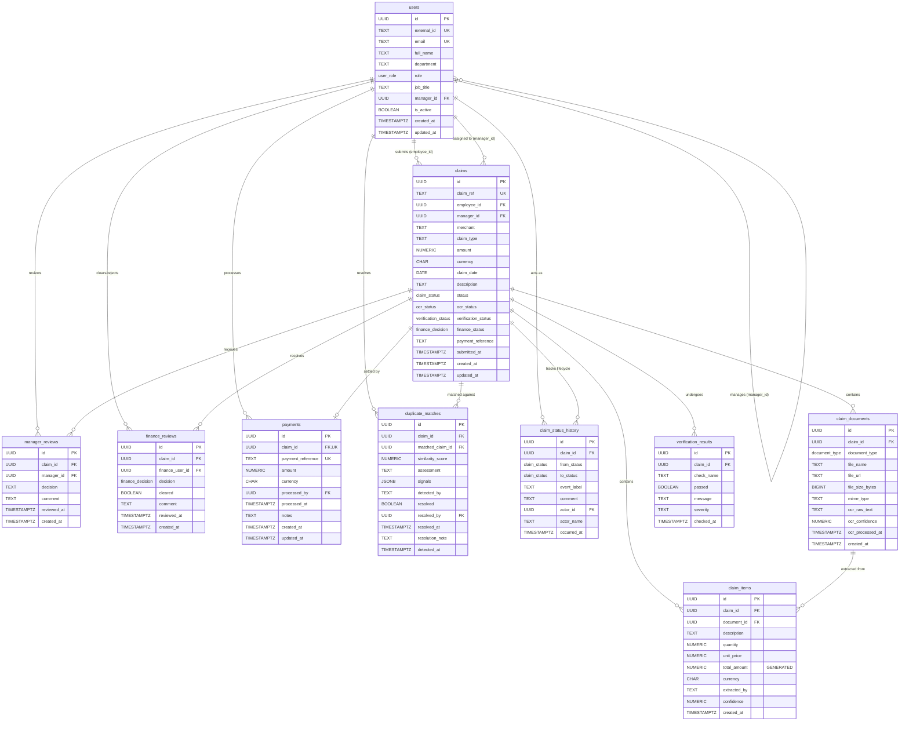
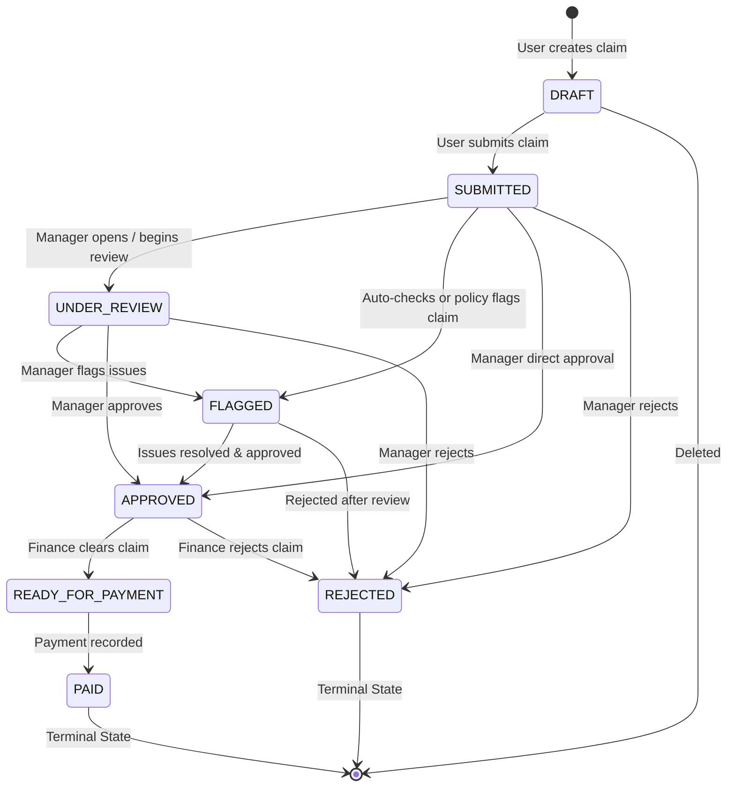

# Expense Claims System — Database Documentation

Comprehensive schema specification, entity-relationship diagrams, enum references, state lifecycles, indexes, and setup instructions for PostgreSQL on Supabase.

---

## 1. Architecture Overview

The database is built on **PostgreSQL (Supabase)** and follows a relational model with strict referential integrity:

- **Primary Keys:** UUID v4 generated via `uuid-ossp` (`uuid_generate_v4()`).
- **Timestamps:** ISO 8601 with timezone (`TIMESTAMPTZ`), automated `updated_at` triggers.
- **Audit Trails:** Immutable history tables (`claim_status_history`) for compliance.
- **Full-Text & Similarity Search:** Trigram index (`pg_trgm`) on merchant names.
- **Generated Columns:** `claim_items.total_amount` is computed automatically (`quantity * unit_price`).

---

## 2. Entity Relationship Diagram (ERD)



---

## 3. Custom Enum Types

| Enum Name | Values | Description |
|---|---|---|
| `user_role` | `'staff'`, `'manager'`, `'finance'` | System access role |
| `claim_status` | `'DRAFT'`, `'SUBMITTED'`, `'UNDER_REVIEW'`, `'FLAGGED'`, `'APPROVED'`, `'REJECTED'`, `'READY_FOR_PAYMENT'`, `'PAID'` | Main lifecycle status |
| `ocr_status` | `'PENDING'`, `'PROCESSING'`, `'COMPLETED'`, `'FAILED'`, `'SKIPPED'` | Receipt parsing status |
| `verification_status`| `'PENDING'`, `'CLEAN'`, `'FLAGGED'`, `'ERROR'` | Automated policy check outcome |
| `document_type` | `'RECEIPT'`, `'INVOICE'`, `'BOARDING_PASS'`, `'OTHER'` | Attached file classification |
| `finance_decision` | `'FINANCE_PENDING'`, `'FINANCE_CLEARED'`, `'FINANCE_REJECTED'`, `'FINANCE_EXCEPTION'` | Finance verification state |

---

## 4. Claim Lifecycle & State Machine



---

## 5. Table Specifications

### 5.1 `users`
Stores all staff members, managers, and finance team users. Supports hierarchical reporting via self-referencing `manager_id`.

| Column | Type | Constraints | Default | Description |
|---|---|---|---|---|
| `id` | `UUID` | PRIMARY KEY | `uuid_generate_v4()` | Unique user identifier |
| `external_id` | `TEXT` | UNIQUE | `NULL` | Legacy/seed reference (e.g. `usr-001`) |
| `email` | `TEXT` | NOT NULL, UNIQUE | — | Corporate email address |
| `full_name` | `TEXT` | NOT NULL | — | Full display name |
| `department` | `TEXT` | — | `NULL` | Department (e.g. Engineering, Sales) |
| `role` | `user_role`| NOT NULL | `'staff'` | User role: `staff`, `manager`, `finance` |
| `job_title` | `TEXT` | — | `NULL` | Designatory title |
| `manager_id` | `UUID` | REFERENCES `users(id)` | `NULL` | Direct manager UUID |
| `is_active` | `BOOLEAN` | NOT NULL | `TRUE` | Whether user account is active |
| `created_at` | `TIMESTAMPTZ`| NOT NULL | `NOW()` | Creation timestamp |
| `updated_at` | `TIMESTAMPTZ`| NOT NULL | `NOW()` | Auto-updated on record modification |

---

### 5.2 `claims`
The core expense claim entity.

| Column | Type | Constraints | Default | Description |
|---|---|---|---|---|
| `id` | `UUID` | PRIMARY KEY | `uuid_generate_v4()` | Unique claim ID |
| `claim_ref` | `TEXT` | UNIQUE | `NULL` | Human-readable ref code (e.g. `CLM-1031`) |
| `employee_id` | `UUID` | NOT NULL, REFERENCES `users(id)` | — | User who owns the claim |
| `manager_id` | `UUID` | REFERENCES `users(id)` | `NULL` | Assigned reviewing manager |
| `merchant` | `TEXT` | — | `NULL` | Vendor/Merchant name (e.g. Uber, Amazon) |
| `claim_type` | `TEXT` | NOT NULL | — | Category (Travel, Office Supplies, Meals, etc.) |
| `amount` | `NUMERIC(12,2)`| NOT NULL | `0` | Total claimed amount |
| `currency` | `CHAR(3)` | NOT NULL | `'INR'` | ISO currency code |
| `claim_date` | `DATE` | — | `NULL` | Date expense occurred |
| `description` | `TEXT` | — | `NULL` | Business justification |
| `status` | `claim_status`| NOT NULL | `'DRAFT'` | Main state machine status |
| `ocr_status` | `ocr_status`| NOT NULL | `'PENDING'` | OCR processing status |
| `verification_status`| `verification_status` | NOT NULL | `'PENDING'` | Automated validation status |
| `finance_status` | `finance_decision` | — | `NULL` | Finance review state |
| `payment_reference` | `TEXT` | — | `NULL` | Reference code after payout |
| `submitted_at` | `TIMESTAMPTZ`| — | `NULL` | Timestamp when user submitted |
| `created_at` | `TIMESTAMPTZ`| NOT NULL | `NOW()` | Initial draft creation |
| `updated_at` | `TIMESTAMPTZ`| NOT NULL | `NOW()` | Auto-updated timestamp |

---

### 5.3 `claim_documents`
Stores receipt and invoice attachments along with raw OCR extraction text and confidence score.

| Column | Type | Constraints | Default | Description |
|---|---|---|---|---|
| `id` | `UUID` | PRIMARY KEY | `uuid_generate_v4()` | Unique document ID |
| `claim_id` | `UUID` | NOT NULL, REFERENCES `claims(id)` ON DELETE CASCADE | — | Parent claim ID |
| `document_type` | `document_type` | NOT NULL | `'RECEIPT'` | `RECEIPT`, `INVOICE`, `BOARDING_PASS`, `OTHER` |
| `file_name` | `TEXT` | — | `NULL` | Original filename |
| `file_url` | `TEXT` | — | `NULL` | Storage URL (Supabase Storage / S3) |
| `file_size_bytes` | `BIGINT` | — | `NULL` | File size in bytes |
| `mime_type` | `TEXT` | — | `NULL` | e.g. `application/pdf`, `image/jpeg` |
| `ocr_raw_text` | `TEXT` | — | `NULL` | Raw unstructured text extracted by OCR |
| `ocr_confidence` | `NUMERIC(5,4)` | — | `NULL` | OCR confidence (0.0000 to 1.0000) |
| `ocr_processed_at` | `TIMESTAMPTZ` | — | `NULL` | Completion timestamp of OCR run |
| `created_at` | `TIMESTAMPTZ` | NOT NULL | `NOW()` | Upload timestamp |

---

### 5.4 `claim_items`
Individual line items broken down from receipts.

| Column | Type | Constraints | Default | Description |
|---|---|---|---|---|
| `id` | `UUID` | PRIMARY KEY | `uuid_generate_v4()` | Unique line item ID |
| `claim_id` | `UUID` | NOT NULL, REFERENCES `claims(id)` ON DELETE CASCADE | — | Parent claim ID |
| `document_id` | `UUID` | REFERENCES `claim_documents(id)` ON DELETE SET NULL | `NULL` | Source document if extracted |
| `description` | `TEXT` | NOT NULL | — | Item description |
| `quantity` | `NUMERIC(10,3)` | NOT NULL | `1` | Quantity |
| `unit_price` | `NUMERIC(12,2)` | NOT NULL | `0` | Unit price |
| `total_amount` | `NUMERIC(12,2)` | **GENERATED ALWAYS AS (quantity * unit_price) STORED** | — | Automatic computed line total |
| `currency` | `CHAR(3)` | NOT NULL | `'INR'` | Currency code |
| `extracted_by` | `TEXT` | — | `'MANUAL'` | `OCR` or `MANUAL` |
| `confidence` | `NUMERIC(5,4)` | — | `NULL` | Extraction confidence score |
| `created_at` | `TIMESTAMPTZ` | NOT NULL | `NOW()` | Record creation timestamp |

---

### 5.5 `verification_results`
Stores automated rule checks (e.g. weekend expense, duplicate check, policy threshold, receipt date matching).

| Column | Type | Constraints | Default | Description |
|---|---|---|---|---|
| `id` | `UUID` | PRIMARY KEY | `uuid_generate_v4()` | Result record ID |
| `claim_id` | `UUID` | NOT NULL, REFERENCES `claims(id)` ON DELETE CASCADE | — | Target claim ID |
| `check_name` | `TEXT` | NOT NULL | — | Rule name (e.g. `policy_limit`, `weekend_check`) |
| `passed` | `BOOLEAN` | NOT NULL | — | `true` if passed, `false` if flagged |
| `message` | `TEXT` | — | `NULL` | Human-readable explanation |
| `severity` | `TEXT` | NOT NULL | `'INFO'` | `INFO`, `WARNING`, or `ERROR` |
| `checked_at` | `TIMESTAMPTZ` | NOT NULL | `NOW()` | Execution timestamp |

---

### 5.6 `duplicate_matches`
Tracks suspected duplicate claims flagged by automated similarity detection.

| Column | Type | Constraints | Default | Description |
|---|---|---|---|---|
| `id` | `UUID` | PRIMARY KEY | `uuid_generate_v4()` | Unique record ID |
| `claim_id` | `UUID` | NOT NULL, REFERENCES `claims(id)` ON DELETE CASCADE | — | Current claim being analyzed |
| `matched_claim_id` | `UUID` | REFERENCES `claims(id)` ON DELETE SET NULL | `NULL` | Existing claim that matched |
| `similarity_score` | `NUMERIC(5,4)` | — | `NULL` | Match percentage (0.0 to 1.0) |
| `assessment` | `TEXT` | — | `NULL` | Assessment summary |
| `signals` | `JSONB` | NOT NULL | `'[]'::jsonb` | Array of signal tags (`["same_amount", "same_merchant"]`) |
| `detected_by` | `TEXT` | — | `'RULE'` | Detection engine (`RULE`, `AI`, `MANUAL`) |
| `resolved` | `BOOLEAN` | NOT NULL | `FALSE` | Has a reviewer resolved the match? |
| `resolved_by` | `UUID` | REFERENCES `users(id)` | `NULL` | Reviewer user UUID |
| `resolved_at` | `TIMESTAMPTZ` | — | `NULL` | Resolution timestamp |
| `resolution_note` | `TEXT` | — | `NULL` | Notes on why resolved as false/valid positive |
| `detected_at` | `TIMESTAMPTZ` | NOT NULL | `NOW()` | Detection timestamp |

---

### 5.7 `claim_status_history`
**Immutable Audit Trail** recording every status transition. Rows in this table must never be updated or deleted.

| Column | Type | Constraints | Default | Description |
|---|---|---|---|---|
| `id` | `UUID` | PRIMARY KEY | `uuid_generate_v4()` | Audit entry ID |
| `claim_id` | `UUID` | NOT NULL, REFERENCES `claims(id)` ON DELETE CASCADE | — | Target claim ID |
| `from_status` | `claim_status` | — | `NULL` | Previous status (`NULL` on creation) |
| `to_status` | `claim_status` | NOT NULL | — | New status |
| `event_label` | `TEXT` | NOT NULL | — | Event title (e.g. `Claim Submitted`, `Approved`) |
| `comment` | `TEXT` | — | `NULL` | Reason / note added by actor |
| `actor_id` | `UUID` | REFERENCES `users(id)` | `NULL` | User UUID who performed the action |
| `actor_name` | `TEXT` | — | `NULL` | Cached actor name |
| `occurred_at` | `TIMESTAMPTZ` | NOT NULL | `NOW()` | Transition timestamp |

---

### 5.8 `manager_reviews`
Records manager review rounds and decisions.

| Column | Type | Constraints | Default | Description |
|---|---|---|---|---|
| `id` | `UUID` | PRIMARY KEY | `uuid_generate_v4()` | Review record ID |
| `claim_id` | `UUID` | NOT NULL, REFERENCES `claims(id)` ON DELETE CASCADE | — | Reviewed claim ID |
| `manager_id` | `UUID` | NOT NULL, REFERENCES `users(id)` | — | Reviewing manager UUID |
| `decision` | `TEXT` | NOT NULL | — | Decision code (`APPROVED`, `REJECTED`, etc.) |
| `comment` | `TEXT` | — | `NULL` | Manager review notes |
| `reviewed_at` | `TIMESTAMPTZ` | NOT NULL | `NOW()` | Timestamp of review |
| `created_at` | `TIMESTAMPTZ` | NOT NULL | `NOW()` | Record creation timestamp |

---

### 5.9 `finance_reviews`
Records finance verification decisions.

| Column | Type | Constraints | Default | Description |
|---|---|---|---|---|
| `id` | `UUID` | PRIMARY KEY | `uuid_generate_v4()` | Review record ID |
| `claim_id` | `UUID` | NOT NULL, REFERENCES `claims(id)` ON DELETE CASCADE | — | Target claim ID |
| `finance_user_id` | `UUID` | NOT NULL, REFERENCES `users(id)` | — | Finance officer UUID |
| `decision` | `finance_decision` | NOT NULL | — | `FINANCE_CLEARED`, `FINANCE_REJECTED`, etc. |
| `cleared` | `BOOLEAN` | NOT NULL | `FALSE` | `true` if approved for payment |
| `comment` | `TEXT` | — | `NULL` | Finance notes |
| `reviewed_at` | `TIMESTAMPTZ` | NOT NULL | `NOW()` | Decision timestamp |
| `created_at` | `TIMESTAMPTZ` | NOT NULL | `NOW()` | Record creation timestamp |

---

### 5.10 `payments`
Terminal payment record created when a claim in `READY_FOR_PAYMENT` is settled. Exactly one payment per claim (`claim_id` UNIQUE).

| Column | Type | Constraints | Default | Description |
|---|---|---|---|---|
| `id` | `UUID` | PRIMARY KEY | `uuid_generate_v4()` | Unique payment ID |
| `claim_id` | `UUID` | NOT NULL, UNIQUE, REFERENCES `claims(id)` | — | Associated claim ID |
| `payment_reference` | `TEXT` | UNIQUE | `NULL` | Bank / UPI / wire transaction ref (e.g. `PAY-2026-0910-001`) |
| `amount` | `NUMERIC(12,2)` | NOT NULL | — | Paid amount |
| `currency` | `CHAR(3)` | NOT NULL | `'INR'` | Currency code |
| `processed_by` | `UUID` | REFERENCES `users(id)` | `NULL` | Finance user who released payment |
| `processed_at` | `TIMESTAMPTZ` | — | `NULL` | Execution timestamp |
| `notes` | `TEXT` | — | `NULL` | Settlement remarks / transfer note |
| `created_at` | `TIMESTAMPTZ` | NOT NULL | `NOW()` | Record timestamp |
| `updated_at` | `TIMESTAMPTZ` | NOT NULL | `NOW()` | Auto-updated timestamp |

---

## 6. Triggers and Indexes

### Automated `updated_at` Trigger
A single PL/pgSQL trigger function automatically updates the `updated_at` timestamp before any `UPDATE` on `users`, `claims`, and `payments`:

```sql
CREATE OR REPLACE FUNCTION trigger_set_updated_at()
RETURNS TRIGGER AS $$
BEGIN
  NEW.updated_at = NOW();
  RETURN NEW;
END;
$$ LANGUAGE plpgsql;
```

### Performance Indexes

| Table | Index Name | Type / Columns | Purpose |
|---|---|---|---|
| `users` | `idx_users_email` | B-tree (`email`) | Quick lookup by user email |
| `users` | `idx_users_role` | B-tree (`role`) | Filter users by role |
| `users` | `idx_users_manager_id` | B-tree (`manager_id`) | Manager-to-report hierarchy lookups |
| `claims` | `idx_claims_employee_id` | B-tree (`employee_id`) | Staff member claim history queries |
| `claims` | `idx_claims_manager_id` | B-tree (`manager_id`) | Manager review queue queries |
| `claims` | `idx_claims_status` | B-tree (`status`) | Status filtering & queues |
| `claims` | `idx_claims_finance_status`| B-tree (`finance_status`)| Finance queue filtering |
| `claims` | `idx_claims_submitted_at` | B-tree (`submitted_at DESC`)| Chronological sorting of submissions |
| `claims` | `idx_claims_claim_date` | B-tree (`claim_date DESC`) | Expense date sorting |
| `claims` | `idx_claims_merchant` | GIN (`merchant gin_trgm_ops`) | Fast substring & fuzzy search on vendor names |
| `claim_documents` | `idx_claim_documents_claim_id` | B-tree (`claim_id`) | Fetch documents for a claim |
| `claim_items` | `idx_claim_items_claim_id` | B-tree (`claim_id`) | Fetch line items for a claim |
| `verification_results`| `idx_verification_results_claim_id` | B-tree (`claim_id`) | Fetch verification results |
| `duplicate_matches` | `idx_duplicate_matches_claim_id` | B-tree (`claim_id`) | Match detection results by claim |
| `claim_status_history`| `idx_claim_status_history_claim_id` | B-tree (`claim_id`) | Claim timeline reconstruction |
| `claim_status_history`| `idx_claim_status_history_occurred_at` | B-tree (`occurred_at DESC`)| Global activity feed |
| `payments` | `idx_payments_claim_id` | B-tree (`claim_id`) | Fast 1-to-1 payment link |
| `payments` | `idx_payments_payment_reference`| B-tree (`payment_reference`) | Reconcile bank transactions |

---

## 7. Migration & Setup Instructions

The migration SQL scripts are located in `Backend/db/migrations/`:

### Step 1: Optional Reset (Fresh install)
To wipe all tables and enums cleanly:
- Open **Supabase Dashboard** -> **SQL Editor** -> New query.
- Copy & run `Backend/db/migrations/000_nuke.sql`.

### Step 2: Apply Schema
- In Supabase SQL Editor, run `Backend/db/migrations/001_initial_schema.sql`.
- This creates extensions, enums, all 10 tables, generated columns, indexes, and triggers.

### Step 3: Load Seed Data
- In Supabase SQL Editor, run `Backend/db/migrations/002_seed_data.sql`.
- Loads staff users (`usr-001`), managers (`usr-mgr-001`), finance controller (`usr-fin-001`), sample claims (`CLM-1031`, `CLM-1028`, `CLM-1024`, etc.), line items, audit logs, and test payment records.

---

## 8. Backend Integration

The FastAPI backend connects using the `supabase-py` client in `Backend/app/core/database.py`:

```python
from supabase import create_client, Client
from app.core.config import settings

supabase: Client = create_client(settings.SUPABASE_URL, settings.SUPABASE_KEY)
```

Ensure the following variables are present in `Backend/.env`:
```ini
VITE_SUPABASE_URL=https://your-project.supabase.co
VITE_SUPABASE_ANON_KEY=your-anon-or-service-key
```
