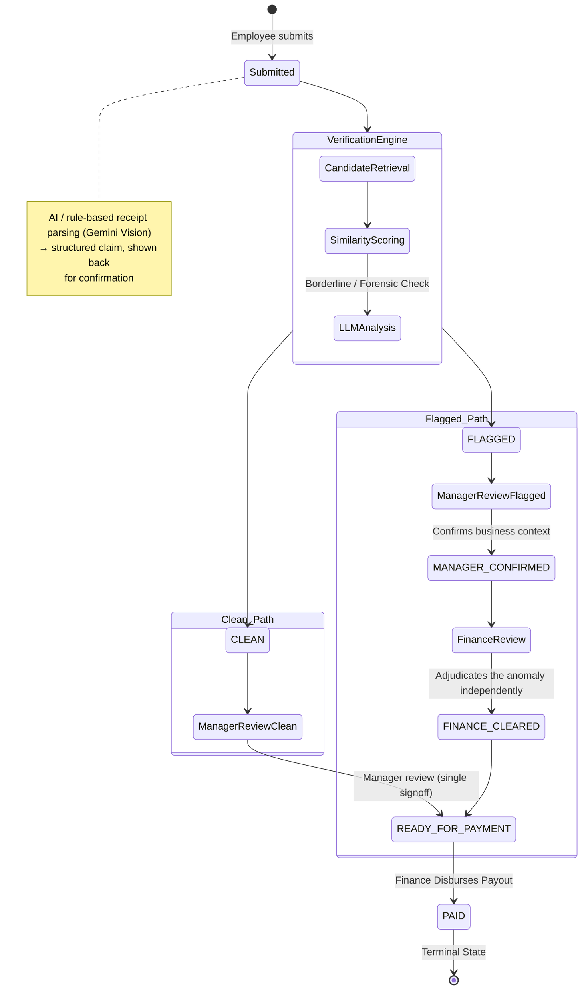

# 💸 AI-Powered Expense Claims & Forensic Verification System

An intelligent, multi-tier corporate expense reimbursement and forensic anomaly detection system built with **FastAPI**, **Supabase (PostgreSQL)**, **React + Vite**, and **Google Gemini Vision & Forensic AI**.

---

## 🏗️ System Design & Lifecycle Flow



---

## 🌟 Key Capabilities

### 1. 🤖 Intelligent Receipt OCR Extraction
- Automatic optical character recognition and metadata extraction from receipts/invoices (PDF, PNG, JPEG) using **Gemini Vision**.
- Line-item breakdown, merchant categorization, tax extraction, and confidence scoring with editable verification prior to submission.

### 2. 🛡️ Forensic Duplicate & Policy Verification Engine
- **Multi-signal similarity engine**: Compares incoming claims against historical database records using merchant string distance, invoice number matching, exact date proximity, amount variance, and SHA-256 receipt file hashes.
- **LLM Forensic Analysis**: For borderline or high-similarity claims, Gemini AI generates duplicate risk percentages, forensic explanations, and actionable manager recommendations.

### 3. 👥 Multi-Tier Separation of Duties
- **Staff Portal (`Vickey Kumar`)**: Create draft claims, upload and analyze bills, view real-time status history with SLA timers and decision comments.
- **Manager Portal (`Rahul Sharma`)**: Inspect direct report submissions, view AI duplicate evidence, confirm business context on flagged claims, or approve clean claims.
- **Finance Portal (`Anita Joshi`)**: Audit flagged anomalies, clear exceptions, execute mock payment disbursements (`TXN-PAY-{YYYYMMDD}-{HEX}`), and view live spend analytics.

### 4. ⏱️ Audit Trail & SLA Tracking
- Comprehensive audit timeline recording actor names, timestamps, step durations, manager justification comments, and finance clearance notes.

---

## 🛠️ Technology Stack

- **Backend**: Python 3.12+, FastAPI, Pydantic v2, Uvicorn, Supabase Python Client
- **Database & Storage**: Supabase PostgreSQL, Supabase Storage (`receipts` bucket)
- **AI & Forensics**: Google Gemini 2.5 Flash / Pro (Vision & Forensic Evaluation)
- **Frontend**: React 18, Vite, React Router v6, Lucide Icons, Pure CSS Design System

---

## 🚀 Getting Started

### Prerequisites
- Python 3.10+
- Node.js 18+
- Supabase project credentials & Google Gemini API key

### 1. Backend Setup
```bash
cd Backend
python -m venv venv
# Windows:
.\venv\Scripts\activate
# Linux/macOS:
source venv/bin/activate

pip install -r requirements.txt
uvicorn main:app --reload --port 8000
```
Backend API interactive documentation will be available at `http://127.0.0.1:8000/docs`.

### 2. Frontend Setup
```bash
cd Frontend
npm install
npm run dev -- --port 5173
```
Frontend portal will be accessible at `http://localhost:5173/`.
