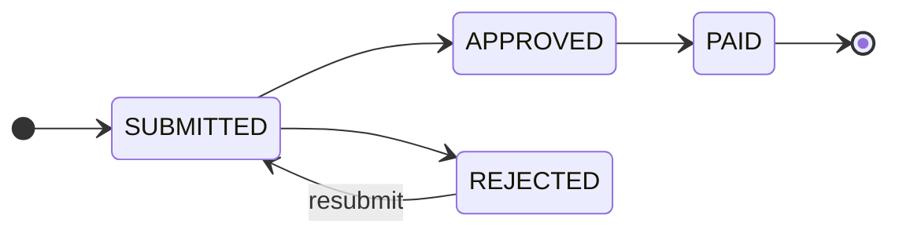
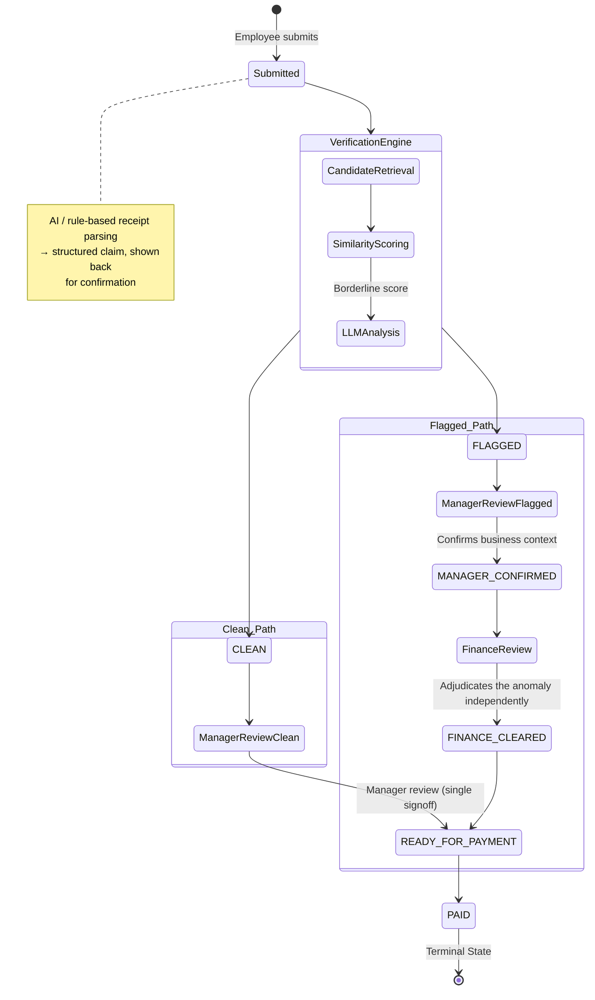

# 📄 Expense Claim System — Design Documentation

> [!IMPORTANT]
> **Status:** MVP design frozen. Implementation not yet started against this version.
> **Purpose of this document:** record not just the final design, but why it changed shape — so a future reviewer (including a future us) can see which decisions were deliberate trade-offs versus gaps, and doesn't have to re-litigate settled questions.

---

## 1. 🎯 The Problem, Restated

Staff spend their own money on travel, meals, supplies, taxis — then claim it back. Manager signs off, finance pays at month-end. Every company has a version of this, and it's painful because filing a claim takes longer than the thing it's claiming.

**Four requirements were given as fixed constraints, not suggestions:**

1. Managers file claims too, and must never approve their own.
2. A paid claim is finished — it must not go backwards.
3. The same receipt gets submitted twice — sometimes same day, sometimes three weeks later, sometimes reworded. Finance has paid duplicates before and this must stop.
4. Finance needs a month-end view: who spent what, by category, who's over limit.
5. Filing should be low-friction — paste the receipt, the system structures it, the person confirms or corrects before it goes anywhere.

---

## 2. ⏪ How We Started: A Single-Pass Design

The first design was a straightforward 4-state machine:

**Rules enforced server-side, not just in the UI:**
- **Self-approval blocked** by comparing submitter ID to approver ID on every transition endpoint.
- **Top-level managers** routed to Finance for approval instead of a peer.
- **Duplicate detection** ran once, at submission, in two tiers (exact hash match & fuzzy match).
- **Receipt parsing** was rule-based first, with an LLM fallback stubbed for fields the rules couldn't extract.

> [!WARNING]
> **The Flaw:** 
> The manager was doing two unrelated jobs at once — verifying the claim was a real, legitimate business expense, *and* being shown a duplicate-similarity flag they had no training or cross-team visibility to evaluate. 

---

## 3. 🔄 How the Design Changed: Separating Who Verifies What

The correction: split verification into two genuinely different competencies, owned by the two roles equipped to exercise them.

| Question | Who answers it | Why them |
| :--- | :--- | :--- |
| **"Is this a real, legitimate expense?"** | 🧑‍💼 Manager | Has direct knowledge of the person and the work — knows if the client dinner actually happened. |
| **"Is this a repeat of something already claimed?"** | 🏦 Finance *(system-assisted)* | Only role with visibility across *all* employees and *all* history. |

> [!TIP]
> **Core Principle:**
> The verification engine detects anomalies. The manager validates business context. Finance adjudicates financial anomalies. Finance executes payment.

### 3.1 Where Duplicate-Checking Runs

An authoritative check at submission, using finance's full dataset, shown live to the employee — this is what got adopted. It's the earliest point with full information and the cheapest point to stop a duplicate.

### 3.2 Why the LLM Only Runs on Borderline Cases

Cheap, deterministic similarity scoring handles the large majority of comparisons. The LLM is reserved for the ambiguous middle: cases the threshold can't confidently resolve either way. 

### 3.3 Two Separate Signatures for Flagged Claims

A flagged claim requires the manager to confirm business context, **and independently** requires finance to adjudicate the anomaly — two separate responsibilities, not two people approving the same thing.

### 3.4 Why the State Names Matter

The adopted version keeps the flagged path's states distinct all the way through:

`FLAGGED → MANAGER_CONFIRMED → FINANCE_REVIEW → FINANCE_CLEARED → READY_FOR_PAYMENT`

---

## 4. 🧊 Current State: The Frozen MVP Design

### 4.1 Org Structure
Tree-structured hierarchy. Every user has a parent in the chain, up to founder. A user can be staff and manager simultaneously.

### 4.2 Full Flow Diagram

> [!CAUTION]
> **Reject** is available at: manager review (either path), or finance review (flagged path).

### 4.3 Rules Carried Through
- Self-approval is structurally blocked.
- `PAID` has no code path leading out of it.
- Top-level manager routes to finance for approval.
- Receipt parsing is shown back to the employee before submission.

---

## 5. 🧩 Known Gaps — Explicitly Parked, Not Solved

These were identified during design review and deliberately deferred:

1. **Segregation of duties inside finance:** The same single point of failure the manager/finance split was meant to avoid could re-appear entirely inside finance.
2. **Reject-from-`MANAGER_CONFIRMED` is undefined:** A manager's non-recognition combined with a system-flagged anomaly is a strong signal; letting it vanish silently loses that signal.
3. **Where policy checks plug in:** Whether policy violations route through the same dual-review branch or surface later in a finance report is undecided.
4. **Staleness / escalation:** No mechanism yet for a claim stuck at `MANAGER_CONFIRMED` or `FINANCE_REVIEW`.
5. **LLM input/output contract:** Candidate set size, output format, and cost controls are not yet specified.

---

## 6. ✅ What's Been Verified So Far

The first-version design was implemented and tested against adversarial cases:

- Self-approval attempt → **blocked**.
- Wrong-approver attempt → **blocked**.
- Second payment attempt on the same claim → **blocked** (terminal state holds).
- Top-level manager → **correctly routed** to and approved by finance.
- Duplicate detection: exact resubmission caught; reworded near-duplicate initially missed but found and fixed.

> [!NOTE]
> The current MVP design has not yet been implemented — the state machine, dual-review branch, and verification engine described here are the target for the next build pass, not a description of running code.
